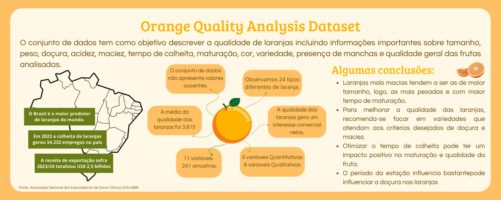

# Análise do Dataset de Qualidade de Laranjas

## Resumo

A avaliação precisa da qualidade das laranjas é crucial para garantir a satisfação dos consumidores e otimizar o processo de distribuição. Métodos tradicionais de avaliação são subjetivos e podem variar entre avaliadores. 
Este projeto busca desenvolver um modelo baseado em um [conjunto de dados](https://www.kaggle.com/datasets/shruthiiiee/orange-quality), aumentar a consistência e a objetividade na classificação da qualidade das laranjas, contribuindo para melhores práticas agrícolas e comerciais utilizando técnicas de Ciências de Dados.

<!--É desejável que também se insira um [graphical abstract](https://www.elsevier.com/authors/tools-and-resources/visual-abstract).-->

## Gráfico Abstrato



## Desenvolvedores
 - [Lívia Nobre #1](https://github.com/LiviaNobre)
 - [Anna Neto #2](https://github.com/annaneto)
 - [Juliana Reis #3](https://github.com/JuSReis)
 - [Gabriela Dias #4](https://github.com/Dias04404)
 - [Luís Fernando de Sá Amorim #5](https://github.com/MoonCancerBR)

<!--
## Funcionalidades

Esse template foi inicialmente baseado no [template de ciência de dados do cookiecutter](https://drivendata.github.io/cookiecutter-data-science/), mas ao longo do tempo várias modificações foram sendo realizadas. Atualmente o template tem as seguintes características:
 - Utilização do arquivo `pyproject.toml` como centralizador de dependências;
 - Configuração para criação de aplicação `streamlit`;
 - Utilização de [jupyter notebooks](https://jupyter.org/) para arquivos de análise;
 - Documentação com o [mkdocs](https://www.mkdocs.org/) ([material design](https://squidfunk.github.io/mkdocs-material/) theme)

### Requisitos

Para utilizar este template, você precisará de um ambiente com os seguintes softwares:
 - git
 - Python 3.8
 - Poetry `1.1.13` ou superior

É aconselhável o uso do `pyenv` para o gerenciamento de versões do Python.


### Organização de diretórios


```
.
├── data/              # Diretório contendo todos os arquivos de dados
│   ├── external/      # Arquivos de dados de fontes externas
│   ├── interim/       # Arquivos de dados intermediários
│   ├── processed/     # Arquivos de dados processados
│   └── raw/           # Arquivos de dados originais, imutáveis
├── docs/              # Documentação gerada através da biblioteca mkdocs
├── models/            # Modelos treinados e serializados, predições ou resumos de modelos
├── notebooks/         # Diretório contendo todos os notebooks utilizados nos passos
├── references/        # Dicionários de dados, manuais e todo o material exploratório
├── src/               # Código fonte utilizado nesse projeto
│   ├── data/          # Classes e funções utilizadas para download e processamento de dados
│   ├── deployment/    # Classes e funções utilizadas para implantação do modelo
│   └── model/         # Classes e funções utilizadas para modelagem
├── app.py             # Arquivo com o código da aplicação do streamlit
├── Procfile           # Arquivo de configuração do heroku
├── pyproject.toml     # Arquivo de dependências para reprodução do projeto
├── poetry.lock        # Arquivo com sub-dependências do projeto principal
├── README.md          # Informações gerais do projeto
└── tasks.py           # Arquivo com funções para criação de tarefas utilizadas pelo invoke

```
-->
